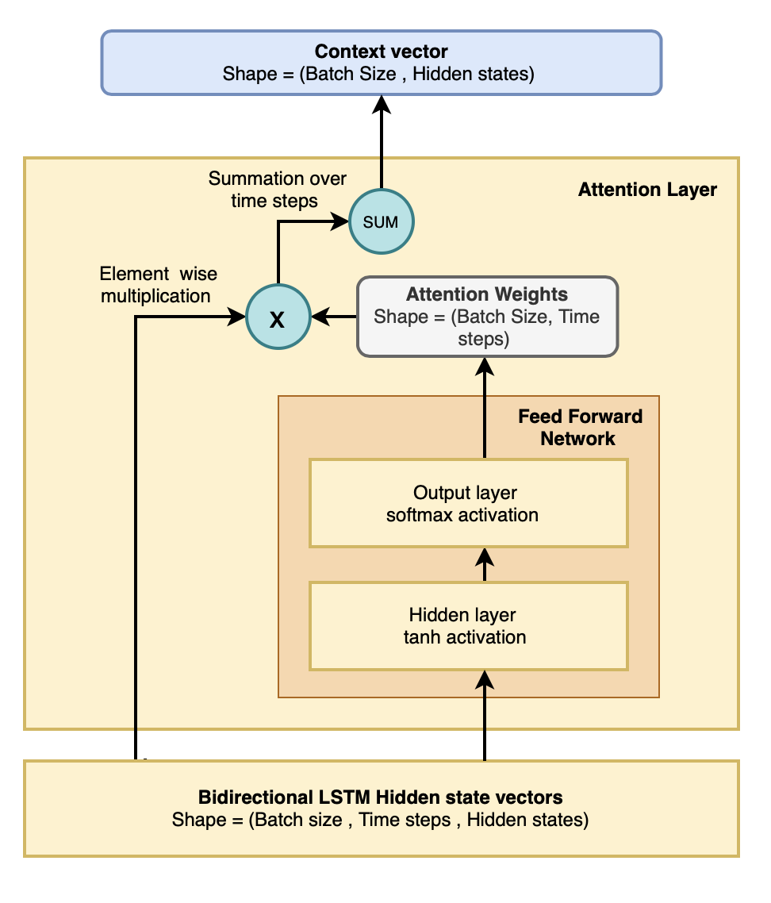
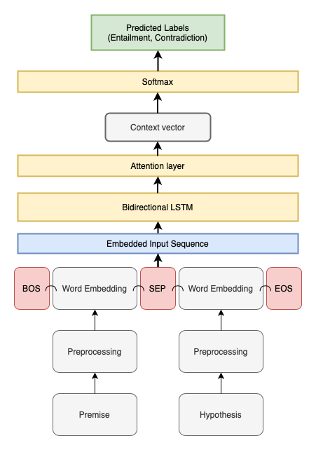
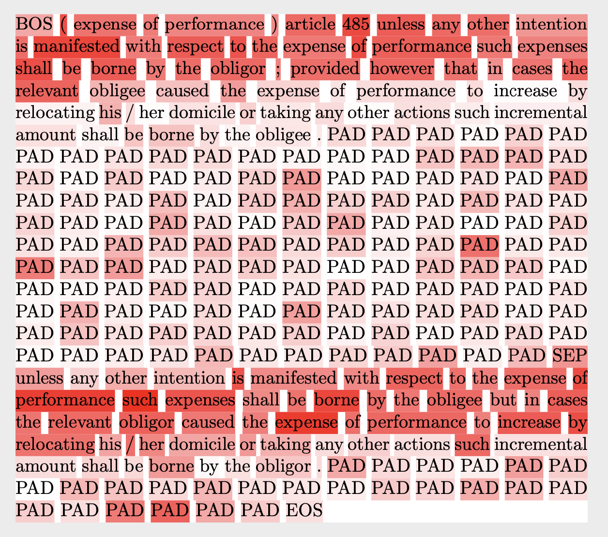

## [Attention Mechanism for Classification](https://venkateshdas.github.io/Attention-Classification/)

  

1.  Introduction
    
2.  Attention for classification task
    
3.  Implementation of Attention models
    
4.  Attention visualisation
    
   

## Introduction :

The history of attention mechanisms starts in the field of Computer Vision [1]. Later then the attention mechanism was introduced in the field of Natural Language Processing to capture the long term dependencies in sequences rather than just using the last hidden state output of the LSTM network. The attention mechanism was first introduced in NLP for the task of machine translation[2] and since then it has been used in various natural language-based tasks such as question answering, text classification, sentiment analysis, PoS Tagging, Document Classification, Document summarization etc.[3]

The attention mechanism generally consists of encoders and decoders in a task where the input and output are of varied sequences [2]. The encoder encodes the input representations and this output is used to create a context vector which is then fed into the decoder to produce an output. The decoder considers the context vector and previous decoder hidden state during the generation of output. This is the general process in a sequence to sequence the attention model.

There are different types of attention mechanisms such as soft attention, hard attention, local attention, global attention and Hierarchical neural attention etc [3]. These mechanisms are used for various tasks in natural language processing.

## Attention for Classification task :

The basic intuition behind using the attention model for binary classification problem of recognizing textual entailment classification tasks is to capture the subset of input tokens in the sequence that defines the class label rather than considering the whole sequence.

The attention mechanism proposed here is inspired by the work of Peng Zhou’s Attention Based BiLSTM network for relation classification [4] and the original Additive attention used in the neural machine translation [2]. The proposed method makes use of soft attention and global attention mechanism to compress the encoded sequence into a context vector that contains the representation of the whole input sequence which is an attention-weighted sum of the individual input representations.

In a classification task, the output label does not have a dependency on previous outputs as it has a defined set of labels and only one output is required. Thus a classification task will consist of an encoder with hidden states and a decoder with no hidden states. The decoder is a classifier with defined output labels.

In the baseline model considered for the task of recognizing textual entailment , the encoder used is a Bidirectional Long Short Term Memory (BiLSTM) network.

Let us consider H = [h1,h2,...........,hT] where h is the hidden state vector for a time step produced by BiLSTM and T is the total number of timesteps. It consists of the hidden state vectors for all the time steps in the input sequence.

This matrix of hidden state vectors is fed into a feedforward network. The operations in the feedforward network take place as suggested in equation 1 and 2. In the hidden layer, the non-linear transformation takes place in the tanh activation function. The output (M) of the hidden layer is fed into the output layer with softmax activation which consists of the nodes that equal the time steps. This output is the attention score (e) or the weights that give importance to particular words in the sequence capturing the long term dependencies. The attention distribution ranges from 0 to 1 as it is an output of the softmax function.

M = tanh(H) ..............................(1)

e = softmax(wTM)......................(2)

In a sequence to sequence model the decoder hidden state is also fed into the feedforward network along with the encoder hidden states. In classification tasks, sequence to one model only the hidden states of the encoder is fed into the feedforward network.

The attention score (e) which is the output of the feedforward network, is then multiplied with the BiLSTM output hidden state vectors (H) for all the timesteps. Then finally, the element-wise product of attention score (e) and H is summed over the time steps to reduce the whole sequence into a vector that produces a deeper representation in a sequence to capture the context. The final output of the attention layer is called the context vector (c).

c = HTe ........................................(3)

T = Transpose of the matrix 

This context vector is fed into the classifier to predict the output of the input sequence. In the baseline model, the classifier is a softmax layer which provides the output.

## Implementation of attention models :

The attention mechanism was integrated with the baseline model by adding an attention layer after the BiLSTM layer. The output of the attention layer is the context vector which is a deeper representation of the whole input sequence. This vector is then fed into a fully connected network with softmax activation which has two output nodes for labels entailment (yes) and contradiction (no).

The loss function and the regularizer used are the same as the baseline model.

The above image illustrates the architecture for the baseline model with Attention model.

The integration of attention mechanism with the POS model was done to understand whether it was able to attend to particular syntactic information for a class label. Similarly, the integration of the SimNeg and POS_SimNeg model with an attention layer was also implemented. This experiment was conducted to understand how much the model attended to the similarity and negation vector to predict the output label.

During the integration of attention mode with POS, SimNeg and POS_SimNeg models only the input embedding vectors were changed respectively while the remaining architecture remained the same.

## Attention Visualisation :

The attention scores can be used to visualise the input sequence to know the words attended by the model for predicting the output. This will help us gain meaningful inferences about the behaviour of the model and understand the decision made by the model for recognizing entailment tasks.

To visualise the attention “Text Attention Heatmap Visualisation” tool [5] was used. It is an open-source toolkit which can be easily configured to our dataset. It takes two arguments as input.

 
  
The list of attention scores and the list of sequences which were given as input to the model for training or testing.

By taking this as input the tool creates a heatmap as provided above in the image. The attended words are highlighted in the chosen colour where the intensity of the colour is based on the attention score. The attention scores are rescaled to a new range of 0 - 100 by this tool for the convenience of creating the heatmap.

